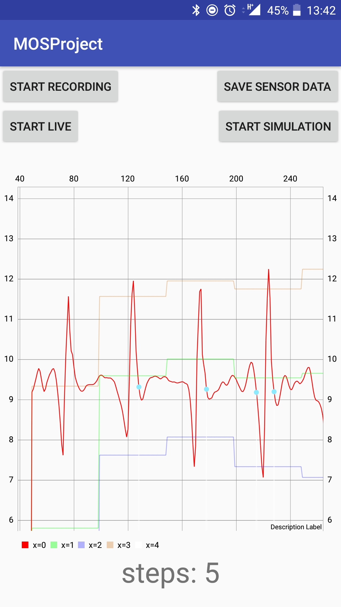

# Mobile Sports
Project and assignments for the university course "Mobile Sports"

**Team:** Eva Jobst, Stefan Schwaighofer

**Possible Project:** Extending the existing application in order to gain specific data that is useful for mountain climbers.

### Assignment 1
- 9th November 2017

##### Mobile Platform
- Language: Java (Android)
- IDE: Android Studio

##### Mockup

- Extensions are possible through the Hamburger-Menu and the Overflow-Section

##### Use-Case-Analysis
\# TODO

##### Effort Estimation
| Task            | Estimated     | Actual |
|----             |----           |----|
| Documentation   | 1h            | 1h |
| Mockups         | 1h            | 2h |
| Development     | 8h            | 12h |

##### Current Development

